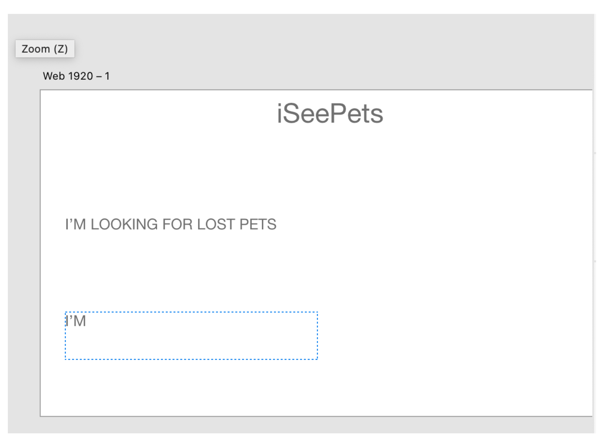
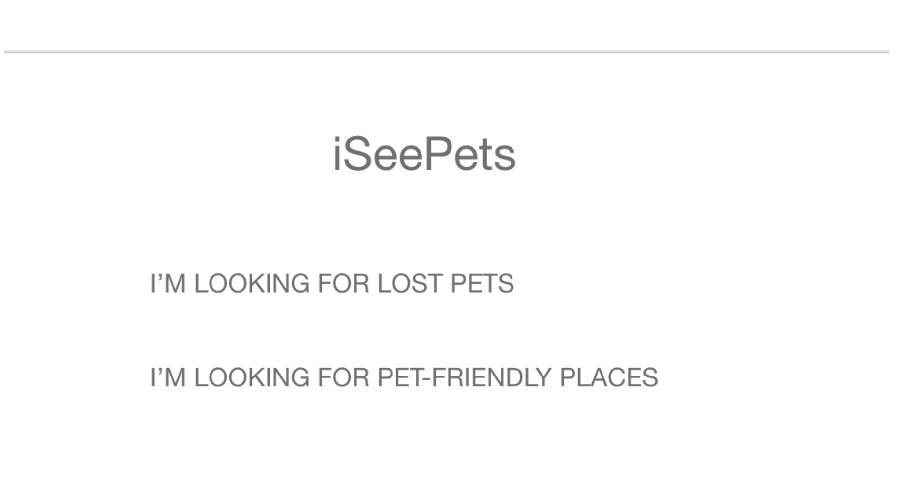

# 1. Project Title: 
* I See Pets

 
 

# 2. Project Description:
* find lost iSeePets
* activities with iSeePets
* *** get a pet ***
* *** adopt a pet ***
* *** find pet friendly stores, restaurants, hotel ***
* find pet groomers
* find someone to walk my pets, dog
* train my pet
* pet socials
* pet a pet - hug a pets

 
 

# 3. User Story:
* As A [ a pet enthusiast ]
* I want to [ be able to do activities with my pet  ]
* So That [ I can create a closer bond ]

 
 

# 4. Wireframe or sketch of the design
## Screen Shots of the Application:

 
 

# 5. API's to be used:
* https://userguide.rescuegroups.org/display/APIDG/API+Developers+Guide+Home?ref=apilist.fun

* https://cloud.google.com/maps-platform/maps?utm_source=google&utm_medium=cpc&utm_campaign=FY20-Q3-global-demandgen-displayonnetworkhouseads-cs-GMP_maps_contactsal_saf_v2&utm_content=text-ad-none-none-DEV_c-CRE_460848633508-ADGP_Hybrid%20%7C%20AW%20SEM%20%7C%20BKWS%20~%20Google%20Maps%20API-KWID_43700033921822021-aud-599437144768%3Akwd-335425467-userloc_9004518&utm_term=KW_google%20maps%20api-ST_google%20maps%20api&gclid=Cj0KCQiA8dH-BRD_ARIsAC24umZhJAJInqlFpqCgnHx4efzJ-u_gM5_VRvDZJCJYkcwm2_cyK3sQN28aAiqQEALw_wcB

 
 

# 6. Rought Breakdown of Tasks:

* To do:

